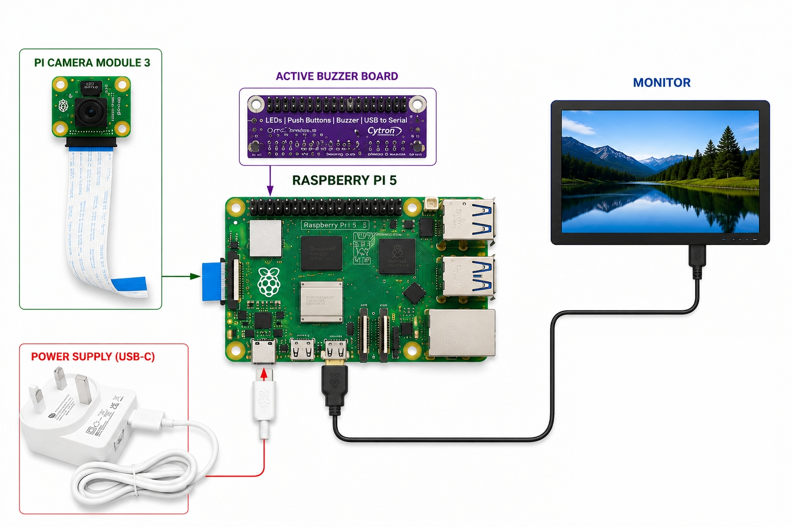
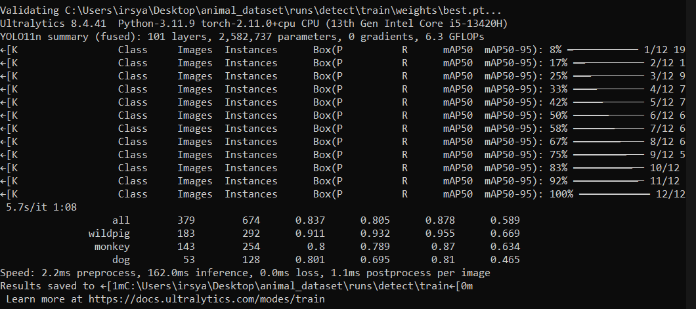
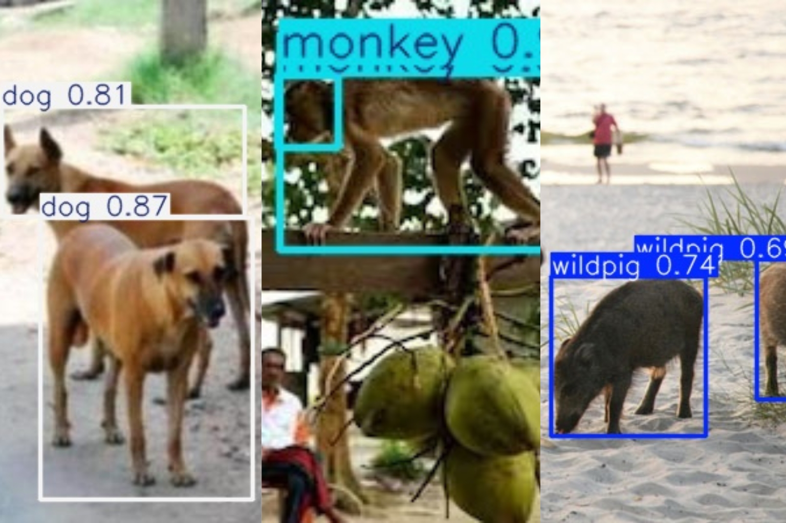

# Smart Wild Animal Detection and Alert System

## Overview

This project was developed to enhance safety in rural and residential areas by integrating artificial intelligence with a Raspberry Pi camera monitoring system.

Conventional monitoring systems only record footage without providing immediate alerts, causing delayed response during wild animal intrusions. This system solves that problem by automatically detecting animals and sending instant notifications to homeowners through Telegram.

The system focuses on detecting :

* Wild Pig
* Monkey
* Dog

---

## Objectives

* Develop an intelligent detection system using Raspberry Pi and AI.
* Detect wild animals in real time.
* Send immediate alerts to homeowners.
* Improve safety and reduce property damage.
* Evaluate detection accuracy and response speed.

---

## System Architecture

```text
Pi Camera Input
      ↓
YOLO11n Detection Model
      ↓
Animal Classification
      ↓
Telegram Alert Notification
      ↓
Continuous Monitoring
```

---

## Features

* Real-time wild animal detection
* Telegram alert notification system
* Buzzer alarm warning system
* Raspberry Pi 5 edge AI deployment
* YOLO11n custom trained model
* Lightweight and portable setup

---

## Technologies Used

| Technology                 | Purpose                   |
| -------------------------- | ------------------------- |
| Python                     | Main programming language |
| Raspberry Pi 5             | Edge AI hardware          |
| OpenCV                     | Image processing          |
| YOLO11n                    | Object detection model    |
| Roboflow                   | Dataset management        |
| Telegram Bot API           | Alert notification        |
| Raspberry Pi Camera Module | Real-time monitoring      |
| Active Buzzer Module       | Sound alert system        |

---

## Project Demonstration

### Hardware Setup

```md

```

### Training Result

```md

```

### Detection Result

```md

```

---

## Sample Testing Media

Sample testing images and videos are available inside the `/media` folder.

The folder contains original media files used during system testing and validation, including :

* Wild Pig
* Monkey
* Dog

These media files may be used to manually test and evaluate the animal detection system.

---

## Model Information

The system uses a custom-trained **YOLO11n** object detection model.

### Trained Classes

* wildpig
* monkey
* dog

### Model Performance

| Class   | Precision | Recall | mAP50 |
| ------- | --------- | ------ | ----- |
| Wildpig | 0.911     | 0.932  | 0.955 |
| Monkey  | 0.800     | 0.789  | 0.870 |
| Dog     | 0.801     | 0.695  | 0.810 |

### Training Details

* Model : YOLO11n
* Epochs : 100
* Training Time : ~16 Hours
* Framework : Ultralytics YOLO

---

## Installation & Setup

### 1. Clone Repository

```bash
git clone https://github.com/IrsyaShah/smart-wild-animal-detection.git
cd smart-wild-animal-detection
```

### 2. Create Virtual Environment

```bash
python -m venv venv
```

### 3. Activate Virtual Environment

Windows :

```bash
venv\Scripts\activate
```

Linux / Mac :

```bash
source venv/bin/activate
```

### 4. Install Required Dependencies

```bash
pip install -r requirements.txt
```

### 5. Configure Telegram Bot

Add your :

* Telegram Bot Token
* Telegram Chat ID

inside the configuration file before running the system.

---

## Run Detection System

```bash
python detect.py
```

---

## Project Structure

```bash
smart-wild-animal-detection/
│
├── images/
│   ├── setup.jpg
│   ├── training-results.png
│   └── detection-demo.jpg
│
├── media/
│   │
│   ├── images/
│   │   ├── dog/
│   │   ├── wildpig/
│   │   └── monkey/
│   │
│   └── videos/
│       ├── dog/
│       ├── wildpig/
│       └── monkey/
│
├── model/
│   ├── best.pt
│   └── animals.yaml
│
├── src/
│   ├── detect.py
│   ├── camera.py
│   ├── telegram_alert.py
│   └── buzzer.py
│
├── requirements.txt
├── .gitignore
└── README.md
```

---

## Author

### Irsya Shah

This project was independently designed, developed and deployed by **Irsya Shah** as part of a personal AI and IoT development project.
All implementation, testing and deployment were completed independently, including model training, Raspberry Pi setup and real-time monitoring integration.

Full Stack & Backend-Specialist Developer

LinkedIn : [Irsya Shah](https://www.linkedin.com/in/irsyashah/)
